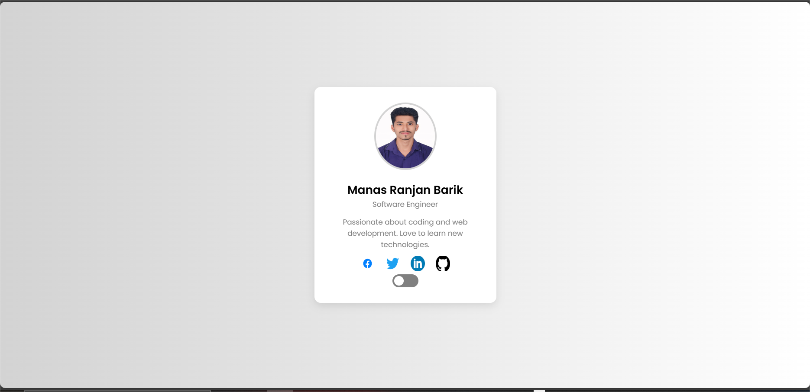

# Profile Card Project

## 🌟 Overview
This is a **Profile Card** project that displays user information with a **dark mode toggle** and interactive **social media icons**. It is built using **HTML, CSS, and JavaScript**.

## 🚀 Features
✅ Responsive Profile Card with user details  
✅ Social media icons with hover effects  
✅ Dark mode toggle for a better user experience  
✅ Smooth animations and transitions  

## 📂 File Structure
```
📁 Profile-Card-Project
│── index.html  (Main HTML file)
│── styles.css  (Styling file)
│── script.js   (JavaScript file)
└── images/     (Folder for profile image & social media icons)
```

## 🛠️ Technologies Used
- **HTML** – Structure of the profile card
- **CSS** – Styling and animations
- **JavaScript** – Dark mode toggle functionality

## 🎨 UI Preview
(## 🎨 UI Preview

)

## 🔧 How to Use
1. **Clone the repository**:  
   ```bash
   git clone https://github.com/manasranjanbarik1010/profile-card-project.git
   ```
2. **Open `index.html`** in a browser.
3. **Click the 🌙 Toggle Dark Mode button** to switch themes.

## 🌍 Live Demo
[Click here to view the live demo](https://github.com/manasranjanbarik1010/profile-card-project)

## 📜 License
This project is open-source and free to use under the **MIT License**.

---
👨‍💻 **Developed by:** Manas Ranjan Barik
